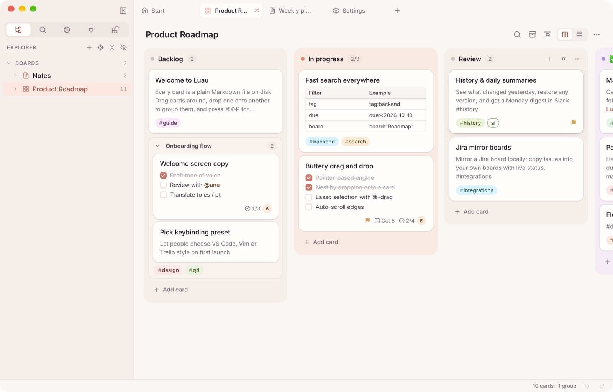
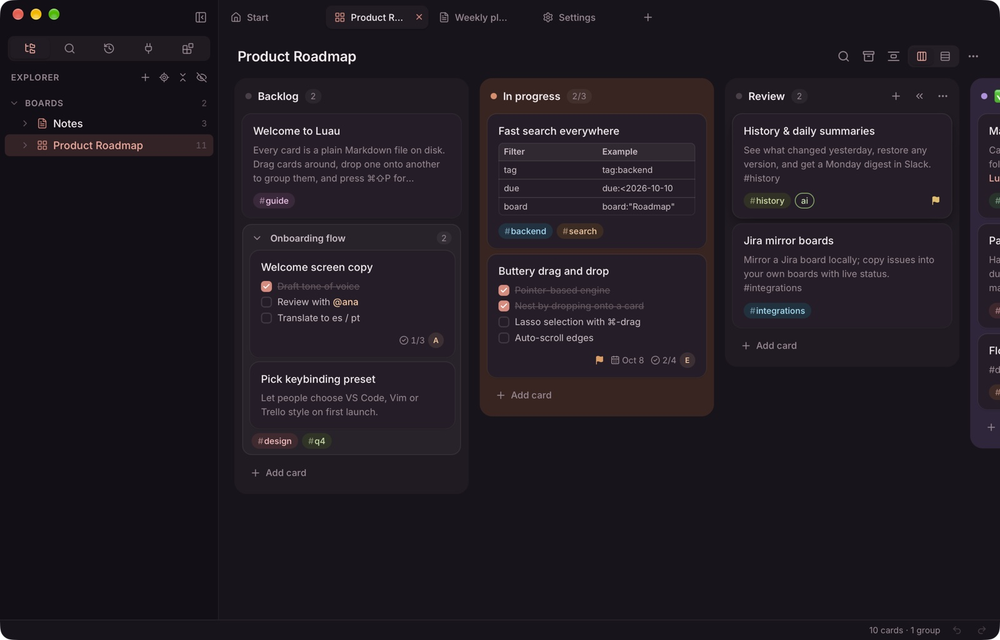
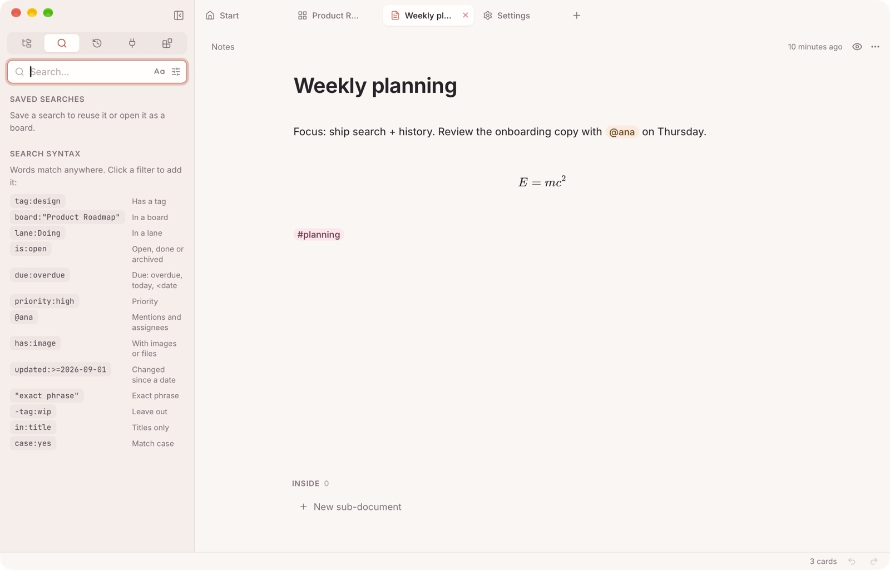
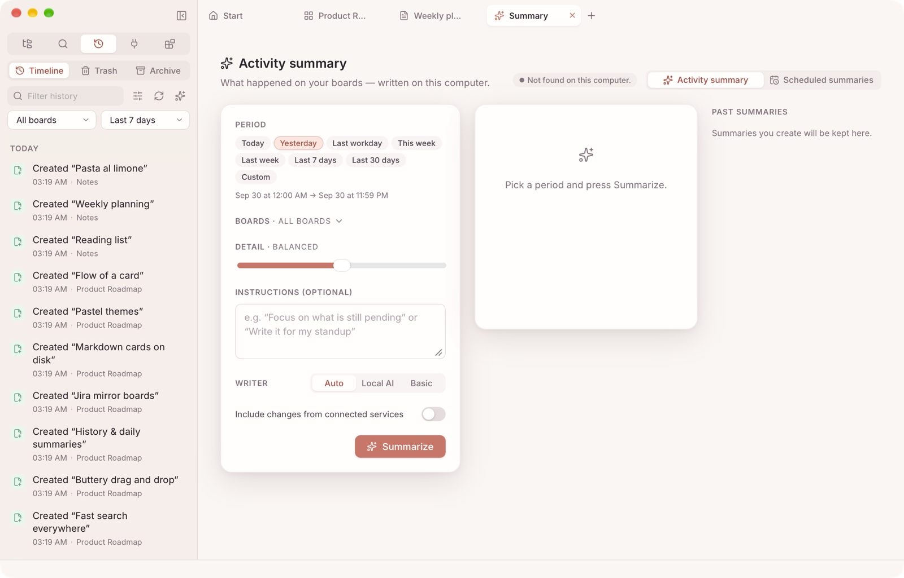
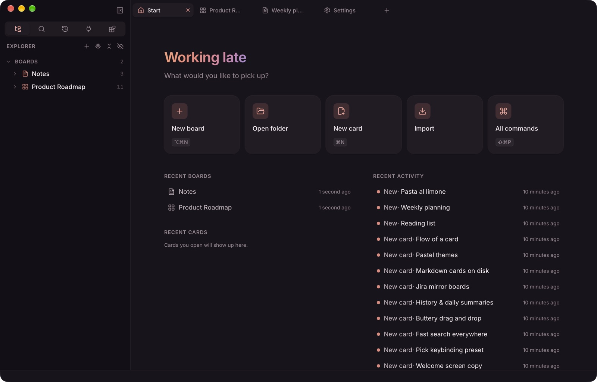
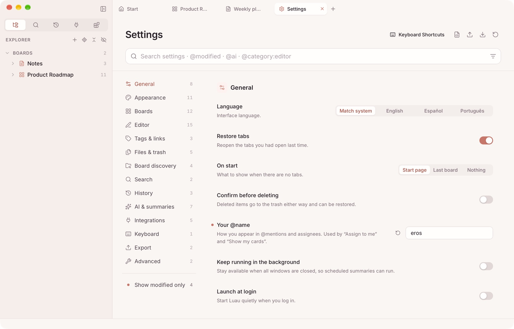

<p align="center">
  
</p>

<h1 align="center">Luau</h1>

<p align="center">
  A calm, local-first <b>kanban board</b> and <b>Markdown notes</b> app for macOS, Windows and Linux.<br>
  Every card is a plain Markdown file in a folder you own. No accounts, no cloud, no lock-in.
</p>

<p align="center">
  <a href="docs/SPEC.md">Specification</a> ·
  <a href="docs/ARCHITECTURE.md">Architecture</a> ·
  <a href="CONTRIBUTING.md">Contributing</a> ·
  <a href="SECURITY.md">Security</a> ·
  <a href="LICENSE">MIT license</a>
</p>

<p align="center">
  
</p>

<p align="center">
  
  
</p>

## Why Luau

- **Your files, your folders.** A board is any folder with a hidden `.luau/` directory. Lanes are folders and
  cards are `.md` files, so they stay readable in any editor and sync with git, Dropbox or iCloud.
- **Feels great.** Smooth drag and drop, an Obsidian/Notion-style live-preview editor, a VS Code-style command
  palette, and keyboard shortcuts for everything (with VS Code, Trello, Vim and Emacs presets).
- **Remembers everything.** Undo for every action, full per-card history with diff and restore, a trash, and
  local-AI summaries of what you did.
- **Light and native.** Tauri 2, a Rust core and Svelte 5: a ~15 MB app that opens a board in under half a second.
- **Calm by design.** Pastel "Hawaii sunset" colors, light and dark themes, Liquid Glass translucency on macOS,
  and respect for reduced motion.

## Features

### Boards
- **Kanban boards**, with lanes as columns or rows.
  - Lanes: colors, WIP limits, collapse, archive.
  - Cards show: tags, tasks, due dates, priority, assignees, covers.
- **Group cards:** drop a card onto another to nest it, as deep as you like.
- **Files boards:** a tree of Markdown documents that open in tabs.
- **Quick add**, multi-select (⇧-click, ⌘-drag lasso), find-in-board, per-board zoom.
- **Board templates:** Kanban basic, Sprint, Personal, Notes, and two **guide boards** (kanban and notes) that
  show every Markdown feature on real cards: *New board from template → Luau guide*.

### Editor
- **Live preview** on CodeMirror 6 that renders:
  - tables, callouts and code;
  - **math** (KaTeX) and **diagrams** (Mermaid);
  - **embeds** and heading links;
  - **Python cells** with their output.
- `[[Card links]]` by title, `#tags` and `@mentions` with autocomplete, and a `/` slash menu.
- **Natural dates:** type `[next friday]` or `[in 3 days]` and it becomes a real date.
- Images and PDFs with resizable thumbnails, rich paste (HTML → Markdown), and a properties footer for priority,
  dates and assignees.
- Optional Vim mode and spellcheck. Autosave never overwrites changes made outside the app.

### Find and remember
- **Search** across all boards with a small query language (`tag:` `board:` `is:open` `due:overdue` `@ana`
  `"exact phrase"` `-tag:wip`…). The filter UI stays in sync with the query, and searches can be saved and opened
  as boards.
- **History** timeline with a word-level diff and *restore this version*, plus **Trash** and **Archive** views.
- **AI that stays local by default**: Apple's built-in on-device model (zero setup), Ollama or LM Studio (*Set up
  local AI…* installs and verifies Ollama for you), or — only if you choose and allow it — Claude, ChatGPT, Gemini
  or OpenRouter with your own key, kept in the keychain.
- **Activity summaries** ("what did I do yesterday?"), scheduled or on demand, delivered by notification or Slack.
- **Change with AI…** rewrites a selection by your instruction with a before/after preview; **Quick summary…**
  answers questions from your boards and history; **AI…** is an assistant that can also make changes (it asks
  first for Jira / Trello / Slack, deletes and big changes, and one ⌘Z undoes a run).
- **Create card from clipboard** or **Task from Slack** (your latest @mention): one card as is, or AI-drafted cards
  with tasks, tags, due dates and assignees.

<p align="center">
  
  
</p>

### Work with others' tools (optional)
- **Jira Cloud and Data Center**, **Trello** and **Slack**:
  - search issues and drag them onto your boards as linked cards;
  - mirror whole boards, kept up to date every minute when watched;
  - transition issues, assign them and comment;
  - create an issue from a card.
- **Every write to an external service** shows a confirmation that lists exactly what will change. Tokens are kept
  in your OS keychain.

### Everything else
- **Tabs, split view and multiple windows.** An Explorer tree with drag and drop. A start page.
- **Import and export:**
  - Import any Markdown folder (e.g. an Obsidian vault).
  - Export a board, card or document as HTML, PDF, Markdown, ZIP or JSON.
- **Settings:** about 80 options with search. A full keyboard-shortcut editor (record keys, chords,
  when-clauses). Import and export of `settings.json`.
- **Languages:** English, Español, Português.

<p align="center">
  
</p>

## Install

Download the latest release for your platform from the **Releases** page:

| Platform | Package |
|---|---|
| macOS 13+ (Apple Silicon, Intel) | `.dmg` |
| Windows 10/11 (x64, ARM64) | `.exe` installer or `.msi` |
| Linux (x64, ARM64) | `.AppImage`, `.deb`, `.rpm` |

On first launch Luau asks for your language, look, keyboard style and where to look for boards. macOS may ask
once for access to folders such as Documents or Desktop while it looks for boards.

## Build from source

Requirements: **Node 24+**, **pnpm 12+**, **Rust stable (1.90+)**, and the
[Tauri prerequisites](https://tauri.app/start/prerequisites/) for your OS.

```bash
pnpm install
pnpm dev                    # desktop app with hot reload
pnpm dev:web                # UI only, in the browser, with an in-memory mock backend (http://localhost:1420)
pnpm build --localtarget    # release build for this machine (macOS: .app + .dmg)
pnpm build --release        # every target this host can build (CI builds all six)
```

**Checks** (all run in CI):

```bash
pnpm lint            # ESLint + Prettier
pnpm check           # svelte-check
pnpm test            # vitest
pnpm i18n en         # translation keys (also: es, pt)
pnpm check:tauri     # npm ↔ Rust Tauri versions in step
cargo fmt --all -- --check && cargo clippy --workspace --all-targets -- -D warnings && cargo test --workspace
```

## How your data is stored

```text
My board/
├── .luau/board.json        board id, name, lane order, view settings
├── .luau/history/          append-only journal + compressed card versions
├── .luau/trash/            deleted items (kept 7 days by default)
├── k1a2b3c/                a lane (index.json holds its name, order, color)
│   ├── c4d5e6f.md          a card — "# Title" on the first line
│   └── c7g8h9i/index.md    a group card with children inside
```

Luau never rewrites a file just because it opened it. It writes atomically and picks up changes from other
editors live. See the [specification](docs/SPEC.md#3-on-disk-format) for every detail.

## Project layout

```text
src/                Svelte 5 UI — commands, keybindings, editor, panels, i18n (en/es/pt)
src-tauri/          Tauri 2 shell — windows, menus, dialogs, luau:// protocol, RPC
crates/luau-core/   Rust core — store, history, search (SQLite FTS5), import/export, AI, integrations
docs/               SPEC, ARCHITECTURE, change notes, reviews, screenshots
scripts/            build, i18n and version checks
```

## Contributing

Issues and pull requests are welcome. Please read [CONTRIBUTING.md](CONTRIBUTING.md): it covers Conventional
Commits, the checks above, and a short change note in `docs/changes/` for every change. Report security issues
privately as described in [SECURITY.md](SECURITY.md).

## License

[MIT](LICENSE) © 2026 Eros Talevi
