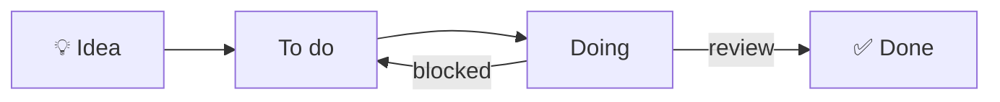
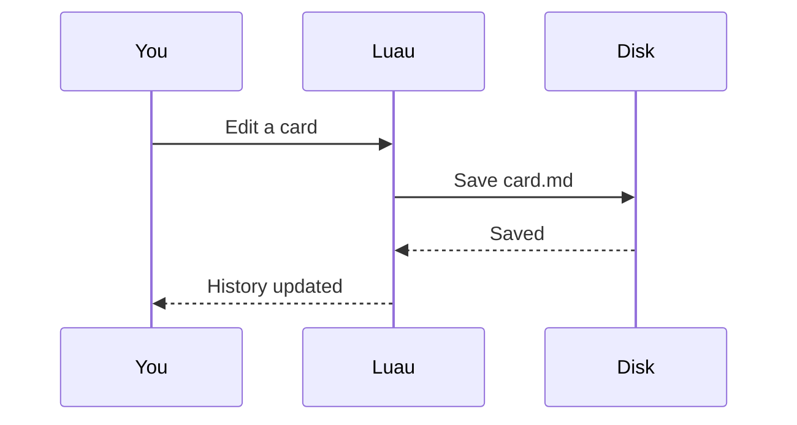
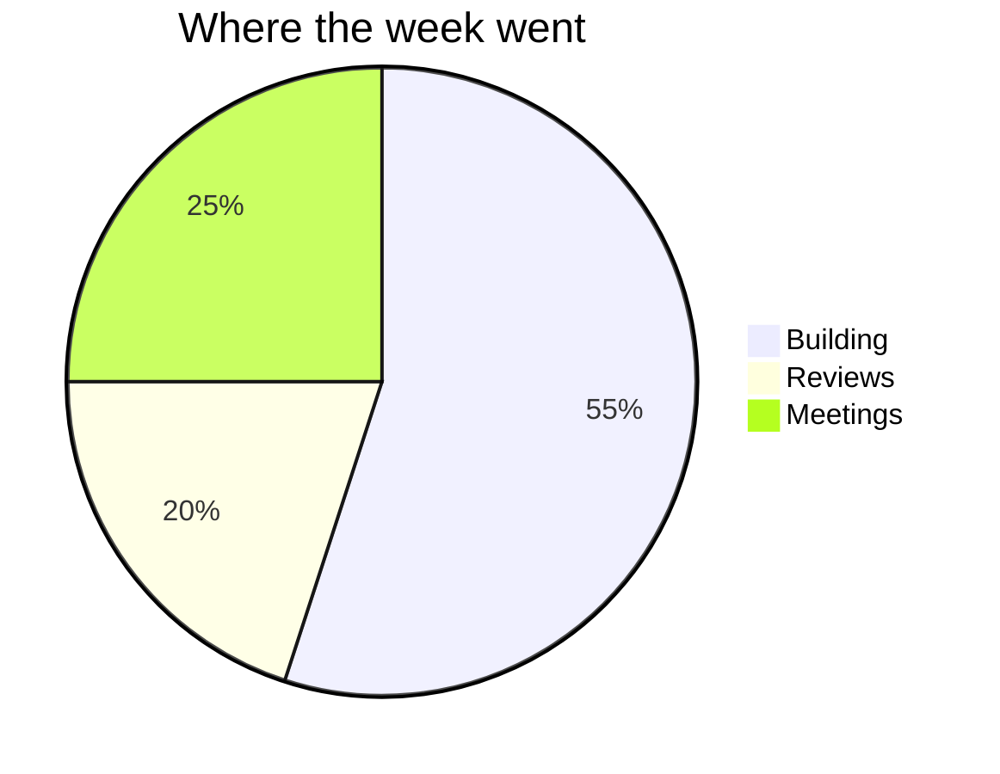

# 🧭 Diagrams

Code blocks marked `mermaid` turn into diagrams that follow the light and dark theme. Click a diagram to edit its source.

## Flowchart

## Sequence

## Pie

More diagram types (Gantt, state, class, mind maps…) are listed at https://mermaid.js.org.

#guide #markdown
